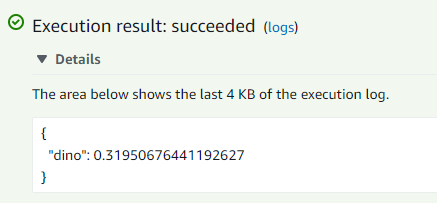

# dino_dragon_deployment
Deployment of the dino/dragon image classification model to aws lambda. 

I worked on this project as part of the ML engineering Zoomcamp provided by [DataTalks Community](https://datatalks.club/)

## Work breakdown

- Convert a tensorflow model to tflite
- Preparing the lambda function
- Creating a docker container based on an image provided by the course 
- Deploying and testing the classification service locally with docker 
- Log in to AWS ECR
- Create a repository for the dino dragon classifier
- Connect to the repository 
- Define remote URI:
    ```
    ACCOUNT=****
    REGION=eu-west-1
    REGISTRY=dino-dragon-images
    PREFIX=${ACCOUNT}.dkr.ecr.${REGION}.amazonaws.com/${REGISTRY}
    TAG=dino-dragon-model-tflite-001
    REMOTE_URI=${PREFIX}:${TAG}
    ```
- Tag the local docker image with the remote URI
    ```
    docker tag dino-dragon:latest ${REMOTE_URI}
    ```
- Push the docker image to ECR
    ```
    docker push ${REMOTE_URI}
    ```
- Create the lambda function
- Increase timeout and memory of the lambda function
- Test the lambda function with this event JSON
    ```json
    {
  "url": "https://upload.wikimedia.org/wikipedia/en/e/e9/GodzillaEncounterModel.jpg"
    }
    ```
    
